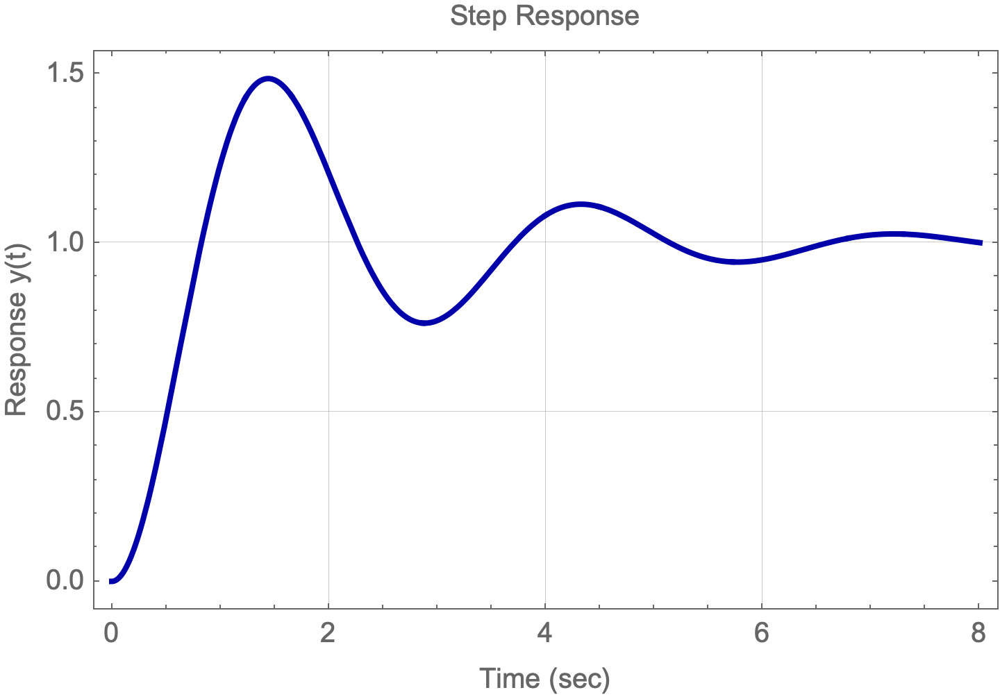

# Control Systems Tutorials using Mathematica

## ****Function Description****

### **`PlotStepResponse`**

The **`PlotStepResponse`** function computes and plots the step response of a given transfer function model. It automatically detects the type of the system (continuous or discrete) based on the transfer function and generates the appropriate response plot.

### Syntax

```mathematica
PlotStepResponse[transferFunctionModel, timeDuration]
```

- **`transferFunctionModel`** - A transfer function model created using Mathematica's **`TransferFunctionModel`**.
- **`timeDuration`** - The time duration for which the step response is to be plotted.

### Implementation

```mathematica
PlotStepResponse[TFM_, duration_ : Automatic] := 
  Module[{systemType, continuous, response, plot, estimatedDuration, 
    poles, realPoles, slowestPole, settlingTimeFactor = 4},
    
    systemType = Variables[TFM[[2]]][[1]];
    continuous = If[systemType == s, True, False];

    If[duration === Automatic,
      poles = TransferFunctionPoles[TFM];

      (* Select real parts of poles that are stable (negative real part) *)
      realPoles = Select[Flatten[Re /@ poles], # < 0 &];
      
      If[realPoles =!= {},
        (* Use the least negative real part to estimate the settling time *)
        slowestPole = Max[realPoles];
        estimatedDuration = settlingTimeFactor * Abs[1/slowestPole],
        (* If there are no stable real poles, use a longer default duration *)
        estimatedDuration = 100
      ],
      (* If duration is specified, use it *)
      estimatedDuration = duration
    ];

    (* Ensure that the estimatedDuration is a numeric value *)
    If[!NumericQ[estimatedDuration], estimatedDuration = 100];

    response = If[continuous, 
      First@OutputResponse[TFM, UnitStep[t], {t, 0, estimatedDuration}],
      First@OutputResponse[TFM, UnitStep[k], {k, 0, estimatedDuration}]
    ];

    plot = If[continuous, 
      Plot[response, {t, 0, estimatedDuration}, PlotRange -> All, 
        PlotStyle -> {Darker[Blue], Thick}, GridLines -> Automatic, 
        Frame -> True, Axes -> None, 
        FrameLabel -> {{"Response y(t)", None}, {"Time (sec)", "Step Response"}}, 
        ImageSize -> Medium],
      ListPlot[response, Filling -> None, PlotRange -> All, 
        DataRange -> {0, estimatedDuration}, AxesOrigin -> {0, 0}, 
        Frame -> True, Axes -> None, Joined -> True, 
        InterpolationOrder -> 0, PlotStyle -> {Darker[Red], Thick}, 
        GridLines -> Automatic, 
        FrameLabel -> {{"Response y(k)", None}, {"Time (sec)", "Step Response"}}, 
        ImageSize -> Medium]
    ];

    plot
  ];
```

### **Usage Example**

To utilize this function, first define a transfer function model, and then call **`PlotStepResponse`** with the model and the desired time duration.

```mathematica
TF[model_] := TransferFunctionModel[model, s];
Gs = TF[5/(s^2 + s + 5)];
PlotStepResponse[Gs, 15]
```


```mathematica
TF[model_] := TransferFunctionModel[model, s];
Gs = TF[5/(s^2 + s + 5)];
PlotStepResponse[Gs]
```




```mathematica
PZMap[Gs_] := Module[
  {p, z, pcor, zcor, pplot, zplot, tfModel},

  (* Construct the transfer function model *)
  tfModel = TransferFunctionModel[Gs, s];

  (* Extract poles and zeros *)
  p = TransferFunctionPoles[tfModel];
  z = TransferFunctionZeros[tfModel];

  (* Display zeros and poles *)
  Print["Transfer Function Zeros are: ", Row[Flatten[z], ", "]];
  Print["Transfer Function Poles are: ", Row[Flatten[p], ", "]];

  (* Compute coordinates for poles and zeros *)
  pcor = Transpose[{Re[p], Im[p]}] // Flatten /@ # &;
  zcor = Transpose[{Re[z], Im[z]}] // Flatten /@ # &;

  (* Create plots for poles and zeros *)
  pplot = ListPlot[pcor, PlotMarkers -> {"X"}, PlotStyle -> Red, PlotLabel -> "Poles"];
  zplot = ListPlot[zcor, PlotMarkers -> {"O"}, PlotStyle -> Blue, PlotLabel -> "Zeros"];

  (* Combine plots and add labels *)
  Show[pplot, zplot,
    PlotRange -> All,
    GridLines -> Automatic,
    AxesOrigin -> {0, 0},
    AxesLabel -> {"Re(s)", "Im(s)"},
    ImageSize -> Medium,
    Frame -> True,
    FrameLabel -> {"Real Axis", "Imaginary Axis"},
    PlotLabel -> "Pole-Zero Map"
  ]
]
```

### Description:

This function `PZMap` is designed to graphically represent the pole-zero map of a given transfer function in the s-domain. The function accepts a transfer function `Gs` as input. It calculates the poles and zeros of the transfer function and displays them on a 2D plot, where the real and imaginary parts of the poles and zeros are plotted on the x-axis (Re(s)) and y-axis (Im(s)), respectively.

Poles are marked with an "X" and zeros with an "O", both in red for clear visibility. The plot includes grid lines for reference and is labeled appropriately, including a frame for enhanced readability. This visual representation is crucial for analyzing the stability and frequency response characteristics of control systems.

### Example Usage:

To use `PZMap` for a specific transfer function, simply call the function with the transfer function as its argument:


```mathematica
PZMap[((s + 5) (s + 7) s (s + 9) (s + 10) (s + 15) (s^2 + 5 s + 8)) /
      ((s^2 + s + 7) (s + 2)^2 (s + 2.04) (s + 8) (s - 8) (s^2 + 5 - 3.8 s))]
```

This call will generate a pole-zero map for the provided transfer function, aiding in the analysis of the system's characteristics.

---


